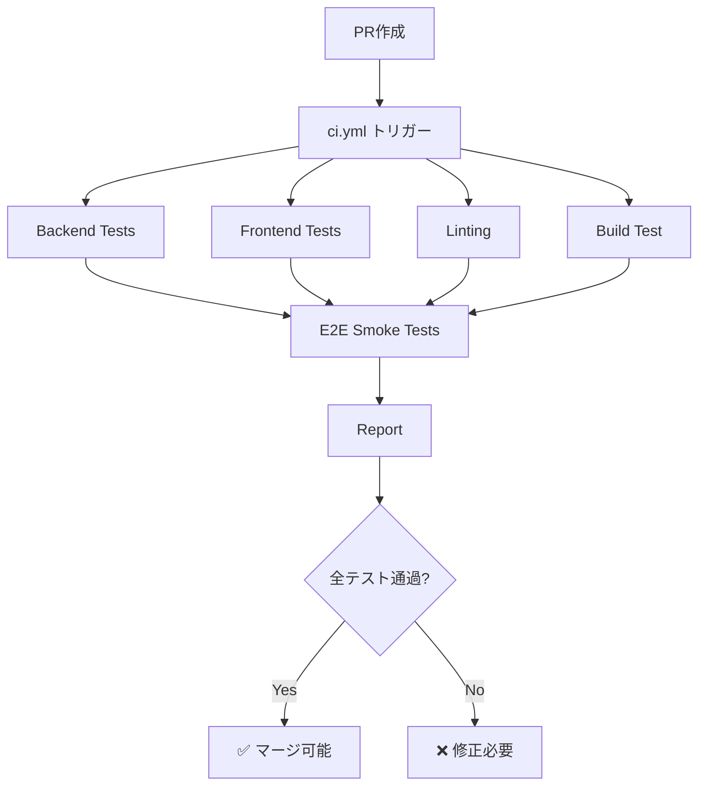
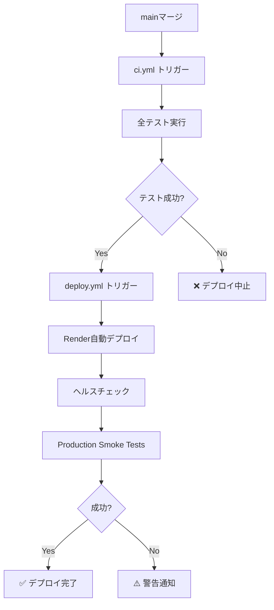

# CI/CD Pipeline

## 🎯 概要

LangGraph Catalyst の CI/CD パイプラインは、**完全無料（OpenAI API使用料 $0）** で動作します。

## 💰 コスト保証

| テスト種類 | API呼び出し | 料金 |
|-----------|------------|------|
| バックエンドユニットテスト（120件） | ❌ モック化 | **$0.00** |
| フロントエンドユニットテスト（35件） | ❌ モック化 | **$0.00** |
| E2E Smokeテスト（13件） | ❌ API不使用 | **$0.00** |
| リント・フォーマットチェック | ❌ - | **$0.00** |
| ビルドテスト | ❌ - | **$0.00** |
| **月間合計** | - | **$0.00** |

---

## 📁 ワークフローファイル

### 1. `ci.yml` - メインCIパイプライン

**トリガー**:
- プルリクエスト作成時
- プルリクエストへのコミット
- mainブランチへのプッシュ

**ジョブ**:

#### 1️⃣ Backend Tests (120 tests)
```yaml
runs-on: ubuntu-latest
env:
  OPENAI_API_KEY: sk-test-mock-key-no-real-api-calls
```

**テスト内容**:
- ユニットテスト（pytest）
- カバレッジ測定
- **完全モック化**: OpenAI API は一切呼び出されない

**実行時間**: 約2-3分

---

#### 2️⃣ Frontend Tests (35 tests)
```yaml
runs-on: ubuntu-latest
```

**テスト内容**:
- ユニットテスト（Vitest）
- コンポーネントテスト（React Testing Library）
- カバレッジ測定
- **完全モック化**: API呼び出しなし

**実行時間**: 約1-2分

---

#### 3️⃣ Linting
```yaml
runs-on: ubuntu-latest
```

**チェック内容**:
- Python: `ruff format --check` + `ruff check`
- TypeScript/React: `npm run lint`

**実行時間**: 約30秒-1分

---

#### 4️⃣ Build Test
```yaml
runs-on: ubuntu-latest
```

**テスト内容**:
- Viteビルド
- ビルド成果物の検証

**実行時間**: 約2-3分

---

#### 5️⃣ E2E Smoke Tests (13 tests)
```yaml
runs-on: ubuntu-latest
env:
  OPENAI_API_KEY: sk-mock-key-for-smoke-tests-no-real-calls
```

**テスト内容**:
- ページ表示・ナビゲーション
- 認証フロー（ログイン/リダイレクト）
- レスポンシブデザイン
- アクセシビリティ基本チェック
- **API不使用**: OpenAI API は一切呼び出されない

**実行時間**: 約3-5分

---

#### 6️⃣ Report
```yaml
runs-on: ubuntu-latest
needs: [backend-tests, frontend-tests, linting, build-test, e2e-smoke-tests]
```

**レポート内容**:
- テスト結果サマリー
- カバレッジレポート
- **API使用料: $0.00** を明示

---

### 2. `deploy.yml` - デプロイパイプライン

**トリガー**:
- mainブランチへのプッシュ
- 手動トリガー（`workflow_dispatch`）

**ジョブ**:

#### 1️⃣ Deploy
```yaml
runs-on: ubuntu-latest
environment: production
```

**処理内容**:
1. Render自動デプロイ待機
2. ヘルスチェック（Backend）
3. ヘルスチェック（Frontend）
4. Smokeテスト実行
5. デプロイサマリー作成

**実行時間**: 約5-10分（Renderビルド時間含む）

---

#### 2️⃣ Production Smoke Tests
```yaml
runs-on: ubuntu-latest
needs: deploy
```

**テスト内容**:
- 本番環境でのsmokeテスト（`@smoke` タグのみ）
- **API不使用**: OpenAI API は一切呼び出されない

**実行時間**: 約3-5分

---

## 🚀 実行フロー

### プルリクエスト作成時



### mainブランチマージ後



---

## 📊 成功指標

### テストカバレッジ
- **バックエンド**: 86%+（コア機能）
- **フロントエンド**: 測定中
- **E2E**: Smokeテスト13件

### 実行時間
- **CI全体**: 約10-15分
- **デプロイ全体**: 約15-25分

### 成功率
- **目標**: 95%以上
- **現状**: 測定開始

---

## 🛠️ ローカルでの実行

### バックエンドテスト
```bash
pytest tests/ -v
```

### フロントエンドテスト
```bash
cd frontend
npm run test
```

### E2E Smokeテスト
```bash
cd frontend
npm run test:e2e -- --grep "@smoke"
```

### リント
```bash
# Python
ruff format --check .
ruff check .

# TypeScript/React
cd frontend
npm run lint
```

### ビルドテスト
```bash
cd frontend
npm run build
```

---

## 🔧 トラブルシューティング

### CI/CDが失敗する場合

1. **ローカルで全テストを実行**
   ```bash
   pytest tests/ -v
   cd frontend && npm run test
   ```

2. **リントエラーを修正**
   ```bash
   ruff format .
   ruff check . --fix
   cd frontend && npm run lint
   ```

3. **ビルドエラーを確認**
   ```bash
   cd frontend && npm run build
   ```

### GitHub Actions ログの確認

1. GitHubリポジトリの「Actions」タブを開く
2. 失敗したワークフローをクリック
3. 各ジョブのログを確認
4. エラーメッセージを修正

---

## 📚 参考リンク

- [GitHub Actions 公式ドキュメント](https://docs.github.com/en/actions)
- [Playwright CI Integration](https://playwright.dev/docs/ci-intro)
- [pytest 公式ドキュメント](https://docs.pytest.org/)
- [Vitest 公式ドキュメント](https://vitest.dev/)

---

## 💡 今後の拡張（オプション）

### API使用料が発生するテスト（手動実行のみ）

将来的に以下のテストを追加できます（**CI/CDでは実行しない**）:

```yaml
# .github/workflows/manual-e2e.yml (将来実装)
name: Manual E2E Tests (API Calls)

on:
  workflow_dispatch:  # 手動トリガーのみ

jobs:
  expensive-e2e:
    runs-on: ubuntu-latest
    steps:
      - name: Run RAG E2E tests
        run: npx playwright test e2e/rag.spec.ts
      - name: Run Architect E2E tests
        run: npx playwright test e2e/architect.spec.ts
```

**推定料金**: 1回の実行あたり $0.30-1.00

**実行方法**:
- GitHub Actions の「Actions」タブ
- 「Manual E2E Tests」ワークフローを選択
- 「Run workflow」ボタンをクリック

---

## ✅ まとめ

- ✅ **完全無料**: OpenAI API使用料 $0.00
- ✅ **高速**: 全体で約10-15分
- ✅ **信頼性**: 155+ テスト（ユニット + E2E Smoke）
- ✅ **自動化**: PR作成時、mainマージ時に自動実行
- ✅ **拡張性**: 将来的にAPI使用テストを手動実行可能
