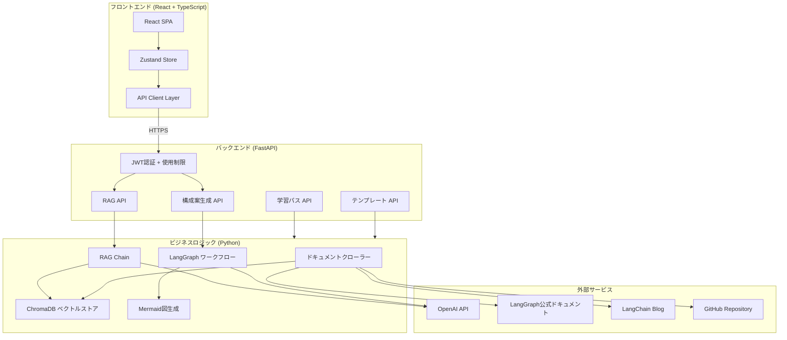
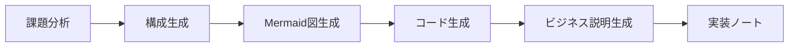

# LangGraph Catalyst

<div align="center">

**LangGraphの学習支援とビジネス活用を促進する学習支援システム**

[](https://www.python.org/)
[](https://react.dev/)
[](https://fastapi.tiangolo.com/)
[](https://github.com/langchain-ai/langgraph)
[](#テストci-cd)

**[デモサイトを見る](https://langgraph-catalyst-frontend.onrender.com)** | **[API Docs](https://langgraph-catalyst-api.onrender.com/docs)**

</div>

---

## 目次

- [システム概要](#システム概要)
- [制作目的・背景](#制作目的背景)
- [技術スタック](#技術スタック)
- [アーキテクチャ](#アーキテクチャ)
- [機能詳細](#機能詳細)
- [工夫した点](#工夫した点)
- [ここを見てほしい](#ここを見てほしい)
- [テスト・CI/CD](#テストci-cd)
- [開発プロセス](#開発プロセス)
- [学んだこと](#学んだこと)
- [今後の展望](#今後の展望)
- [セットアップ](#セットアップ)

---

## システム概要

LangGraph Catalyst は、LangGraph（LangChain公式のステートフルAIエージェントフレームワーク）
を**学び、活用する**ための統合プラットフォームです。

主に2つの機能を提供します。

1. **RAGを用いた学習支援機能** — LangGraphの公式ドキュメント・ブログ・GitHubリポジトリをベクトルDBに取り込み、質問に対してソース付き・コード例付きで回答する
2. **構成案自動生成** — ビジネス課題を入力すると、LangGraphを活用したシステム構成案（Mermaid図 + コード例 + 非技術者向けの説明）を自動生成する

加えて、初級〜上級の**学習パス**とユースケース別の**テンプレート集**を備え、LangGraphの学習から実務活用までを一貫してサポートするように設計

---

## 制作目的・背景

### なぜこのシステムを作ったのか

 AI技術を用いたアプリケーションを最新AIツールを実際に使ってみて開発することで、AI技術の理解・キャッチアップと、最新AIツールの活用能力向上を図りたいと思いました。そこで、気になっていたLangGraphやRAGを用いたシステムを作ってみました。
 LangGraphやRAGの技術を実際に開発に用いたシステムで、かつ、これらの技術の学習をサポートするシステムになっています。
 
#### 背景
- ClaudeCodeの使い方、活用方法を実際にアプリケーションを作りつつ学びたかった。
- AI駆動開発、Vibe Codingでのアプリケーション開発のアウトプットを行いたかった。
- RAGやLangGraph等のAI技術について、知見も使用経験もないので、実際にこれらの技術を用いたシステムを開発し、仕組みや実装方法を学ぼうと思った。
- AIを用いた技術・開発が好きだという事や、日々進化する技術について、インプットだけではなく実際に手を動かして学んでいるという事を、目に見える形で示したかった。
- 知見や経験がない領域(フロントエンドの実装等)も、AI駆動開発でなら実装できるため、フルスタックな開発を行ってみたかった。
- AI駆動開発で実装した内容から、フロントエンドなどの知見がない箇所の勉強もできると思った。

#### 目的
- **Claude Code等のAIツールによるAI駆動開発の習得**
-- 「Vibe Coding」の実践を通じて、次世代の開発方式を体得する。
- **AI技術の理解**
-- RAGやLangGraphを用いたシステム開発を行い、技術のない仕組みと実装手法を理解する。
- **技術への意欲と学習の可視化**
-- 最新技術のインプットに留まらず、実際に手を動かした成果物としてアウトプットする。
- **非専門領域への技術拡張**
-- AIを活用することで、フロントエンド等の知見・経験がない分野を含むフルスタックな開発に挑戦し、知見を広げる。
- **開発を通じた逆引き学習**
-- AIが生成したコードを解析し、自身の未経験領域における技術習得の足掛かりとする。

### なぜLangGraphなのか

AIエージェント技術に興味を持ち、学んでみたかったため、業界標準のフレームワークであるLangGraphを題材として選択しました。

---

## 工夫した点

### 仕様書駆動開発の実践

- CLAUDE.mdを先にClaudeと対話して作成してから実装し、仕様を的確に検討、認識合わせし、実装精度・一貫性を高めた。
- API仕様書、テスト仕様書、を実装前に定義し、AIが一貫した実雄を行えるように配慮した。

### 段階的実装でClaudeCodeの実装精度向上

- TODO.mdを作成し、Phase毎に実行計画をチェックリスト形式で管理する事で、コンテキストが増加した際やリセットした際も
AIが混乱せずに作業を行えるように配慮した。
- 一括で実装するのではなく、Phase毎の段階的実装で実装精度を向上させるようにした。

### AIでのドキュメント作成によるキャッチアップの高速化

- AIにシステムの技術面や使用面の詳細なわかりやすいドキュメントを作成させ、自分が内容を理解しやすくした。

### Claude Codeのskills、MCP活用

- context7のMCP活用でライブラリの最新仕様に沿ったコードを生成した。
- frontend-designのSKILLS活用で、UIの質を向上させた。

### モダンな技術スタックを選定し、時代に合わせたキャッチアップを行えるようにした。

---

## システムの開発工数

期間：約1ヶ月(2026/1月中旬〜2月中旬)　　工数: 約30h

現在も開発中かつシステム実装技術理解中

## 技術スタック

| カテゴリ | 技術 | 選定理由 |
|---------|------|---------|
| **フロントエンド** | React 18 + TypeScript + Vite | 型安全なコンポーネント設計、Viteによる高速な開発体験 |
| **スタイリング** | Tailwind CSS + カスタムCSS変数 + ClaudeCode frontend-skills | 一貫したモダンなデザインシステムを構築 |
| **バックエンドAPI** | FastAPI | 型安全、自動OpenAPIドキュメント生成、非同期対応 |
| **AIフレームワーク** | LangGraph + LangChain | ステートフルなワークフロー構築の業界標準 |
| **LLM** | OpenAI GPT-4 Turbo | ドキュメント・事例が豊富、日本語性能が高い |
| **ベクトルDB** | ChromaDB | 軽量でローカル実行可能、永続化が容易 |
| **認証** | JWT + bcrypt | ステートレスな認証、安全なパスワードハッシュ |
| **CI/CD** | GitHub Actions + Render | プッシュ時の自動テスト・デプロイ |

---

## アーキテクチャ

### システム構成図


---

## 注意点

- **現在このシステムは開発中かつ使用技術、実装内容を理解中です。**
- **デモ時は、正常に動作しない箇所がある可能性がありますが、日々改善中です。**

## 機能詳細

### 1. RAG学習支援システム

**[デモで試す](https://langgraph-catalyst-frontend.onrender.com/rag)**（要ログイン）

LangGraphに関する質問に対し、**根拠（ソース）付き**で回答するRAGシステムです。

**仕組み:**

1. **データ収集** — クローラーがLangGraph公式ドキュメント・LangChain Blog・GitHubリポジトリからドキュメントを取得し、メタデータ（ソースURL、タイトル、種別、更新日時）を付与
2. **ベクトル化・保存** — OpenAI `text-embedding-3-small` でテキストをベクトル化し、ChromaDBに永続保存
3. **検索・回答生成** — ユーザーの質問に対してセマンティック検索を行い、関連ドキュメントをコンテキストとしてGPT-4に渡し、ソース付きの回答を生成

**使用技術:** LangChain RAG Chain, ChromaDB, OpenAI Embeddings, BeautifulSoup4

**出力:** 回答テキスト / 参照元（URL + 関連度スコア） / 実行可能なコード例 / 信頼度スコア

---

### 2. ビジネス課題 → 構成案自動生成

**[デモで試す](https://langgraph-catalyst-frontend.onrender.com/architect)**（要ログイン）

ビジネス課題を入力すると、LangGraphを活用したシステム構成案を自動生成します。

**仕組み（LangGraph StateGraphによる6ノードワークフロー）:**



1. **課題分析** — 入力された課題から要件・キーポイント・LangGraph適合理由を抽出
2. **構成生成** — ノードとエッジの構造を設計（業界・制約条件を考慮）
3. **Mermaid図生成** — 設計結果をフローチャートとして可視化
4. **コード生成** — Pythonの実装サンプルを生成
5. **ビジネス説明生成** — 非技術者にも伝わる平易な解説を生成
6. **実装ノート** — 技術的な注意点をリスト化

**使用技術:** LangGraph StateGraph, LangChain ChatOpenAI, Mermaid.js

**出力:** Mermaidフロー図 / Pythonコード例 / ビジネス説明 / 実装ノート

---

### 3. 学習パス

**[デモで試す](https://langgraph-catalyst-frontend.onrender.com/learning-path)**

初級・中級・上級の3段階でLangGraphを体系的に学べるカリキュラムです。各トピックに学習目標・推定時間・参考リソースを記載し、進捗管理機能（localStorage永続化）を備えています。

---

### 4. テンプレート集

**[デモで試す](https://langgraph-catalyst-frontend.onrender.com/templates)**

カスタマーサポート、データ分析、文書処理など、ユースケース別のLangGraphテンプレートをカテゴリ・難易度でフィルタリングして閲覧できます。各テンプレートにはコード例、Mermaid図、詳細な説明が付属しています。

---

### 5. 認証・使用制限

環境変数ベースの4ユーザー管理（admin + テストユーザー3名）を実装しています。

- **JWT認証** — HS256アルゴリズム、24時間有効
- **パスワード管理** — bcryptハッシュ化
- **使用制限** — テストユーザーは1日5回（RAG・構成案生成が対象）、adminは無制限
- **ルート保護** — React側のProtectedRouteで未認証時にリダイレクト

---

## テスト・CI/CD

### テスト構成

| 種別 | 件数 | フレームワーク | 内容 |
|------|------|--------------|------|
| **Pythonユニットテスト** | 124件 | pytest | クローラー、ベクトルストア、RAGチェーン、LangGraphワークフロー、Mermaid生成、ヘルパー、設定管理、APIエンドポイント |
| **Reactユニットテスト** | 35件 | Vitest + React Testing Library | ページコンポーネント（RAG、Architect）、UIコンポーネント（Button、Card） |
| **E2E Smokeテスト** | 13件 | Playwright | ナビゲーション、認証フロー、レスポンシブ表示、アクセシビリティ |
| **合計** | **155件以上** | — | **API費用: $0**（全テストでOpenAI APIをモック化） |

### CI/CDパイプライン（GitHub Actions）

```
push / PR → ┬─ Pythonテスト (pytest + coverage)
             ├─ Reactテスト (Vitest + coverage)
             ├─ コード品質チェック (Ruff + ESLint)
             ├─ E2E Smokeテスト (Playwright)
             └─ ビルド検証 (Vite build)
                  ↓
             mainブランチマージ時 → Render自動デプロイ
```

- 5つのジョブが**並列実行**され、すべてパスした場合のみデプロイ
- テストカバレッジはCodecovに送信
- E2Eテスト結果はGitHub Artifactsに保存

---

## 今後の展望

- **Claude Code Agent Teamsを用いた開発をやってみたい**
- **実装内容、使用技術の理解を進める**
- **テストの拡充** — E2Eテストの拡充
- **マルチLLM対応** — Claude、Geminiなど複数のLLMプロバイダーを切り替え可能に
- **Performance最適化**

---

## セットアップ

### 前提条件

- Python 3.11+、Node.js 18+、OpenAI APIキー

### 起動手順

```bash
# リポジトリのクローン
git clone https://github.com/your-username/LangGraphCatalyst.git
cd LangGraphCatalyst

# Python環境
python -m venv venv && source venv/bin/activate
pip install -r requirements.txt

# 環境変数
cp .env.example .env
# .envにOPENAI_API_KEYを設定

# ベクトルストア初期化
python scripts/init_vectorstore.py

# バックエンド起動 (http://localhost:8000)
uvicorn backend.main:app --reload

# フロントエンド起動 (別ターミナル、http://localhost:5173)
cd frontend && npm install && npm run dev
```

### デプロイ

Render上でフロントエンド（Static Site）とバックエンド（Web Service）を `render.yaml` で統一管理しています。GitHubへのpushで自動デプロイされます。

- フロントエンド: https://langgraph-catalyst-frontend.onrender.com
- バックエンドAPI: https://langgraph-catalyst-api.onrender.com
- API Docs (Swagger UI): https://langgraph-catalyst-api.onrender.com/docs

---
