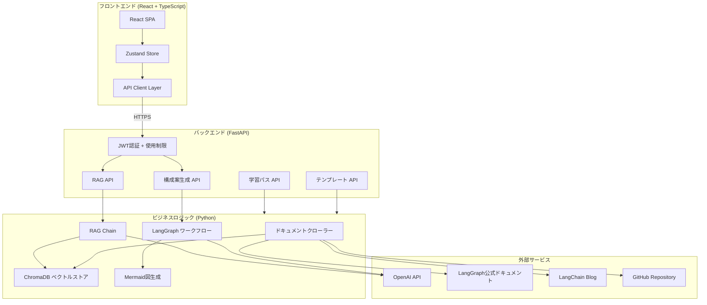
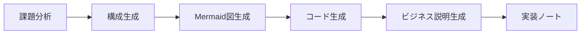

# LangGraph Catalyst

<div align="center">

**LangGraphの学習支援とビジネス活用を促進する「触媒」システム**

[](https://www.python.org/)
[](https://react.dev/)
[](https://fastapi.tiangolo.com/)
[](https://github.com/langchain-ai/langgraph)
[](#テストci-cd)
[](LICENSE)

**[デモサイトを見る](https://langgraph-catalyst-frontend.onrender.com)** | **[API Docs](https://langgraph-catalyst-api.onrender.com/docs)**

</div>

---

## 目次

- [システム概要](#システム概要)
- [制作目的・背景](#制作目的背景)
- [技術スタック](#技術スタック)
- [アーキテクチャ](#アーキテクチャ)
- [機能詳細](#機能詳細)
- [工夫した点](#工夫した点)
- [ここを見てほしい](#ここを見てほしい)
- [テスト・CI/CD](#テストci-cd)
- [開発プロセス](#開発プロセス)
- [学んだこと](#学んだこと)
- [今後の展望](#今後の展望)
- [セットアップ](#セットアップ)

---

## システム概要

LangGraph Catalyst は、LangGraph（LangChain公式のステートフルエージェントフレームワーク）を**学び、活用する**ための統合プラットフォームです。

主に2つの機能を提供します。

1. **RAG学習支援** — LangGraphの公式ドキュメント・ブログ・GitHubリポジトリをベクトルDBに取り込み、質問に対してソース付き・コード例付きで回答する
2. **構成案自動生成** — ビジネス課題を入力すると、LangGraphを活用したシステム構成案（Mermaid図 + コード例 + 非技術者向けの説明）を自動生成する

加えて、初級〜上級の**学習パス**とユースケース別の**テンプレート集**を備え、LangGraphの学習から実務活用までを一貫してサポートします。

---

## 制作目的・背景

### なぜこのシステムを作ったのか

DX推進・AIコンサルティング領域への転職を目指すなかで、「最新のAI技術を理解し、ビジネス価値に変換できる」ことを示すポートフォリオが必要でした。

単にLangGraphを使ったアプリを作るのではなく、**LangGraphを「教える」システム**を構築することで、以下をアピールしています。

- **技術の深い理解** — RAGシステムの設計・実装、LangGraphワークフローの構築
- **ビジネス視点** — 技術を非技術者にも伝わる形に変換する構成案生成機能
- **フルスタック開発力** — React + FastAPI によるモダンなアーキテクチャ
- **エンジニアリング品質** — 155件以上のテスト、CI/CDパイプライン、JWT認証

### なぜLangGraphなのか

LangGraphは複雑なAIエージェントワークフローを**グラフ構造で明示的に管理**できるフレームワークです。状態管理・条件分岐・可視化が組み込まれており、エンタープライズでのAI活用に適しています。このフレームワークの学習コストを下げ、ビジネス活用のイメージを具体化するツールには価値があると考えました。

---

## 技術スタック

| カテゴリ | 技術 | 選定理由 |
|---------|------|---------|
| **フロントエンド** | React 18 + TypeScript + Vite | 型安全なコンポーネント設計、Viteによる高速な開発体験 |
| **スタイリング** | Tailwind CSS + カスタムCSS変数 | ユーティリティファーストで一貫したデザインシステムを構築 |
| **状態管理** | Zustand | Reduxより軽量、localStorage永続化が容易 |
| **バックエンドAPI** | FastAPI | 型安全、自動OpenAPIドキュメント生成、非同期対応 |
| **AIフレームワーク** | LangGraph + LangChain | ステートフルなワークフロー構築の業界標準 |
| **LLM** | OpenAI GPT-4 Turbo | ドキュメント・事例が豊富、日本語性能が高い |
| **ベクトルDB** | ChromaDB | 軽量でローカル実行可能、永続化が容易 |
| **認証** | JWT + bcrypt | ステートレスな認証、安全なパスワードハッシュ |
| **テスト** | pytest / Vitest / Playwright | バックエンド・フロントエンド・E2Eの全層をカバー |
| **CI/CD** | GitHub Actions + Render | プッシュ時の自動テスト・デプロイ |
| **コード品質** | Ruff + ESLint | Python / TypeScript 両方のリント・フォーマット |

---

## アーキテクチャ

### システム構成図



### ディレクトリ構成

```
langgraph-catalyst/
├── frontend/                  # React フロントエンド
│   └── src/
│       ├── pages/             # 6ページ (Home, RAG, Architect, LearningPath, Templates, Login)
│       ├── components/        # 共通UI (Header, CodeBlock, MermaidDiagram, etc.)
│       ├── api/               # API通信層 (7クライアント)
│       ├── store/             # Zustand状態管理 (4ストア)
│       └── types/             # TypeScript型定義
├── backend/                   # FastAPI バックエンド
│   ├── api/v1/                # エンドポイント (RAG, Architect, Auth, LearningPath, Templates)
│   ├── core/                  # 認証・設定・使用制限
│   └── schemas/               # Pydanticスキーマ
├── src/                       # ビジネスロジック (FastAPIから呼び出し)
│   └── features/
│       ├── rag/               # crawler.py, vectorstore.py, chain.py
│       ├── architect/         # graph.py, prompts.py, visualizer.py
│       ├── learning_path/     # 学習パスデータ定義
│       └── templates/         # テンプレートデータ定義
├── tests/                     # Pythonユニットテスト (124件)
├── .github/workflows/         # CI/CDパイプライン
└── render.yaml                # Renderデプロイ設定 (IaC)
```

---

## 機能詳細

### 1. RAG学習支援システム

**[デモで試す](https://langgraph-catalyst-frontend.onrender.com/rag)**（要ログイン）

LangGraphに関する質問に対し、**根拠（ソース）付き**で回答するRAGシステムです。

**仕組み:**

1. **データ収集** — クローラーがLangGraph公式ドキュメント・LangChain Blog・GitHubリポジトリからドキュメントを取得し、メタデータ（ソースURL、タイトル、種別、更新日時）を付与
2. **ベクトル化・保存** — OpenAI `text-embedding-3-small` でテキストをベクトル化し、ChromaDBに永続保存
3. **検索・回答生成** — ユーザーの質問に対してセマンティック検索を行い、関連ドキュメントをコンテキストとしてGPT-4に渡し、ソース付きの回答を生成

**使用技術:** LangChain RAG Chain, ChromaDB, OpenAI Embeddings, BeautifulSoup4

**出力:** 回答テキスト / 参照元（URL + 関連度スコア） / 実行可能なコード例 / 信頼度スコア

---

### 2. ビジネス課題 → 構成案自動生成

**[デモで試す](https://langgraph-catalyst-frontend.onrender.com/architect)**（要ログイン）

ビジネス課題を入力すると、LangGraphを活用したシステム構成案を自動生成します。

**仕組み（LangGraph StateGraphによる6ノードワークフロー）:**



1. **課題分析** — 入力された課題から要件・キーポイント・LangGraph適合理由を抽出
2. **構成生成** — ノードとエッジの構造を設計（業界・制約条件を考慮）
3. **Mermaid図生成** — 設計結果をフローチャートとして可視化
4. **コード生成** — Pythonの実装サンプルを生成
5. **ビジネス説明生成** — 非技術者にも伝わる平易な解説を生成
6. **実装ノート** — 技術的な注意点をリスト化

**使用技術:** LangGraph StateGraph, LangChain ChatOpenAI, Mermaid.js

**出力:** Mermaidフロー図 / Pythonコード例 / ビジネス説明 / 実装ノート

---

### 3. 学習パス

**[デモで試す](https://langgraph-catalyst-frontend.onrender.com/learning-path)**

初級・中級・上級の3段階でLangGraphを体系的に学べるカリキュラムです。各トピックに学習目標・推定時間・参考リソースを記載し、進捗管理機能（localStorage永続化）を備えています。

---

### 4. テンプレート集

**[デモで試す](https://langgraph-catalyst-frontend.onrender.com/templates)**

カスタマーサポート、データ分析、文書処理など、ユースケース別のLangGraphテンプレートをカテゴリ・難易度でフィルタリングして閲覧できます。各テンプレートにはコード例、Mermaid図、詳細な説明が付属しています。

---

### 5. 認証・使用制限

環境変数ベースの4ユーザー管理（admin + テストユーザー3名）を実装しています。

- **JWT認証** — HS256アルゴリズム、24時間有効
- **パスワード管理** — bcryptハッシュ化
- **使用制限** — テストユーザーは1日5回（RAG・構成案生成が対象）、adminは無制限
- **ルート保護** — React側のProtectedRouteで未認証時にリダイレクト

---

## 工夫した点

### 1. ビジネスロジックとUI層の完全分離

`src/features/` にビジネスロジックを集約し、FastAPIのエンドポイントはそれを呼び出すだけの薄いレイヤーとしました。この設計により、Streamlit → React への移行時に**Pythonロジック（120件のテスト含む）を一切変更せず**に移行を完了できました。

### 2. API費用ゼロのテストパイプライン

155件以上のテストすべてでOpenAI APIをモック化し、**CI実行時のAPI費用を完全にゼロ**にしています。LLMの出力をテストするのではなく、「LLMに正しい入力を渡しているか」「LLMの出力を正しく処理しているか」をテストする設計です。

### 3. 構成案生成のLangGraphワークフロー

構成案生成機能は、このシステム自体がLangGraphで構築されています。6つのノードをStateGraphで接続し、各ノードが独立してテスト可能な設計としました。LangGraphを「使う」システムがLangGraphを「教える」という構造になっています。

### 4. Refined Brutalist デザインシステム

汎用的なUIライブラリに頼らず、CSS変数とTailwind CSSで独自のデザインシステムを構築しました。IBM Plex Mono + Crimson Pro のフォント組み合わせ、ダークベースの配色、幾何学的なアクセント要素で、技術的なテーマに合った視覚的アイデンティティを持たせています。

### 5. render.yamlによるInfrastructure as Code

フロントエンド（Static Site）とバックエンド（Web Service）の両方を1つの `render.yaml` で宣言的に管理し、GitHubへのpushで自動デプロイされます。CORS設定、環境変数、キャッシュヘッダー、SPAルーティングまですべてコードで定義しています。

---

## ここを見てほしい

採用担当者の方に特にご覧いただきたいポイントです。

| 見どころ | ファイル | ポイント |
|---------|---------|---------|
| **LangGraphワークフロー設計** | `src/features/architect/graph.py` | 6ノードのStateGraphを用いたワークフロー。状態定義・ノード関数・グラフコンパイルまで一貫した実装 |
| **RAGチェーン実装** | `src/features/rag/chain.py` | ベクトル検索→コンテキスト構築→LLM生成→ソース抽出の一連のパイプライン。学習向け/実装向けの2種類のプロンプト切り替え |
| **テスト設計** | `tests/` | 外部API依存を完全にモック化した124件のテスト。特に `test_architect_graph.py` ではLangGraphの各ノードを独立テスト |
| **API設計** | `backend/api/v1/` | FastAPIのエンドポイント設計。Pydanticスキーマによる型安全なリクエスト/レスポンス、認証・使用制限のDI |
| **CI/CDパイプライン** | `.github/workflows/ci.yml` | バックエンド/フロントエンド/E2Eを並列実行し、API費用ゼロで品質を担保する設計 |
| **フロントエンド状態管理** | `frontend/src/store/` | Zustandによるシンプルな状態管理。認証状態のlocalStorage永続化、学習進捗の永続化 |

---

## テスト・CI/CD

### テスト構成

| 種別 | 件数 | フレームワーク | 内容 |
|------|------|--------------|------|
| **Pythonユニットテスト** | 124件 | pytest | クローラー、ベクトルストア、RAGチェーン、LangGraphワークフロー、Mermaid生成、ヘルパー、設定管理、APIエンドポイント |
| **Reactユニットテスト** | 35件 | Vitest + React Testing Library | ページコンポーネント（RAG、Architect）、UIコンポーネント（Button、Card） |
| **E2E Smokeテスト** | 13件 | Playwright | ナビゲーション、認証フロー、レスポンシブ表示、アクセシビリティ |
| **合計** | **155件以上** | — | **API費用: $0**（全テストでOpenAI APIをモック化） |

### CI/CDパイプライン（GitHub Actions）

```
push / PR → ┬─ Pythonテスト (pytest + coverage)
             ├─ Reactテスト (Vitest + coverage)
             ├─ コード品質チェック (Ruff + ESLint)
             ├─ E2E Smokeテスト (Playwright)
             └─ ビルド検証 (Vite build)
                  ↓
             mainブランチマージ時 → Render自動デプロイ
```

- 5つのジョブが**並列実行**され、すべてパスした場合のみデプロイ
- テストカバレッジはCodecovに送信
- E2Eテスト結果はGitHub Artifactsに保存

---

## 開発プロセス

### Streamlit → React + FastAPI への移行

当初はStreamlitで高速にプロトタイプを構築しましたが、以下の理由でReact + FastAPIへの移行を決断しました。

| 判断軸 | Streamlit | React + FastAPI |
|--------|-----------|-----------------|
| UI自由度 | ウィジェットベースで制約が多い | 完全にカスタム可能 |
| パフォーマンス | サーバーサイドレンダリングで操作のたびに再実行 | CSRで高速なインタラクション |
| スケーラビリティ | UIとロジックが密結合 | API分離により複数クライアント対応可能 |
| ポートフォリオ価値 | データサイエンス寄りの印象 | フルスタック開発力をアピール可能 |

**移行の進め方:**

1. **ビジネスロジックの保護を最優先** — `src/features/` のコードと120件のテストを一切変更しない方針を決定
2. **FastAPIで薄いAPI層を構築** — 既存のPythonロジックをそのまま呼び出すエンドポイントを実装
3. **Reactで段階的にUI構築** — ページ単位で実装し、Zustandで状態管理
4. **安定確認後にStreamlitを完全削除** — 並行稼働期間を設けず、React版の全機能確認後に削除

この経験から、**最初から「交換可能な設計」にしておくことの重要性**を実感しました。

---

## 学んだこと

### 技術面

- **RAGの精度は前処理で決まる** — クローラーのメタデータ付与やチャンク分割の設計が、検索精度に大きく影響する。ベクトル検索だけでなく、メタデータフィルタリングの併用が有効
- **LangGraphのテスタビリティ** — StateGraphの各ノードを独立した関数として実装することで、ワークフロー全体を実行せずに個別テストが可能になる。状態の型定義（TypedDict）が設計の基盤になる
- **LLMアプリのテスト戦略** — LLMの出力自体をテストするのではなく、入出力のインターフェースをテストする。APIモック化により、CI環境でのAPI費用をゼロにできる

### 設計面

- **ビジネスロジックとUI層の分離** — Streamlit → React移行で、この分離がPythonコード変更ゼロでの移行を可能にした
- **Infrastructure as Code** — render.yamlで宣言的にインフラを管理することで、環境の再現性とレビュー可能性が向上する
- **認証は早期に設計すべき** — JWT + 使用制限の実装を後回しにすると、既存のAPIエンドポイントへの影響が大きくなる。依存性注入パターンで後から追加しやすい設計にした

### プロセス面

- **プロトタイプの価値** — Streamlit版で機能要件を素早く検証し、React版で品質を追求するアプローチは効果的だった
- **テスト駆動の安心感** — 124件のPythonテストがあったことで、FastAPI移行時の「既存機能を壊していないか」という不安を解消できた

---

## 今後の展望

- **RAGデータの自動更新** — 現在は手動実行のクローラーを定期実行に変更し、常に最新のLangGraph情報を提供
- **マルチLLM対応** — Claude、Geminiなど複数のLLMプロバイダーを切り替え可能にし、コスト・精度の比較を可能に
- **ストリーミングレスポンス** — RAGと構成案生成の出力をSSEで段階的に表示し、体感速度を改善
- **Lighthouse最適化** — Performance 90+, Accessibility 95+ を目標にフロントエンドの最適化を実施

---

## セットアップ

### 前提条件

- Python 3.11+、Node.js 18+、OpenAI APIキー

### 起動手順

```bash
# リポジトリのクローン
git clone https://github.com/your-username/LangGraphCatalyst.git
cd LangGraphCatalyst

# Python環境
python -m venv venv && source venv/bin/activate
pip install -r requirements.txt

# 環境変数
cp .env.example .env
# .envにOPENAI_API_KEYを設定

# ベクトルストア初期化
python scripts/init_vectorstore.py

# バックエンド起動 (http://localhost:8000)
uvicorn backend.main:app --reload

# フロントエンド起動 (別ターミナル、http://localhost:5173)
cd frontend && npm install && npm run dev
```

### デプロイ

Render上でフロントエンド（Static Site）とバックエンド（Web Service）を `render.yaml` で統一管理しています。GitHubへのpushで自動デプロイされます。

- フロントエンド: https://langgraph-catalyst-frontend.onrender.com
- バックエンドAPI: https://langgraph-catalyst-api.onrender.com
- API Docs (Swagger UI): https://langgraph-catalyst-api.onrender.com/docs

---

## ライセンス

MIT License - 詳細は [LICENSE](LICENSE) をご覧ください。
