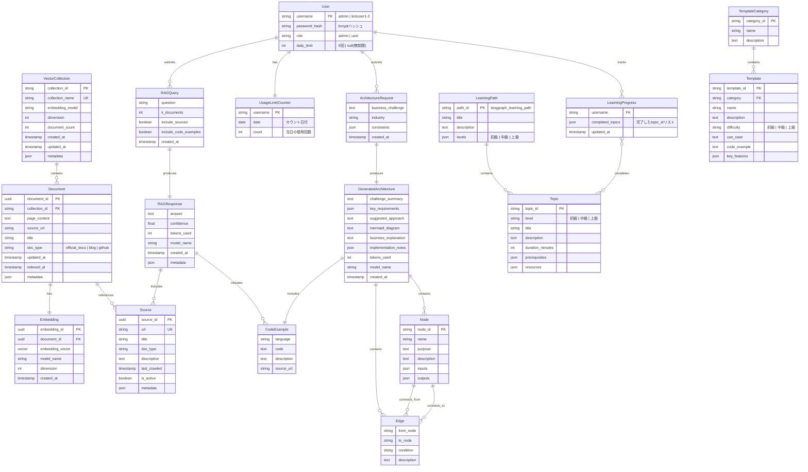
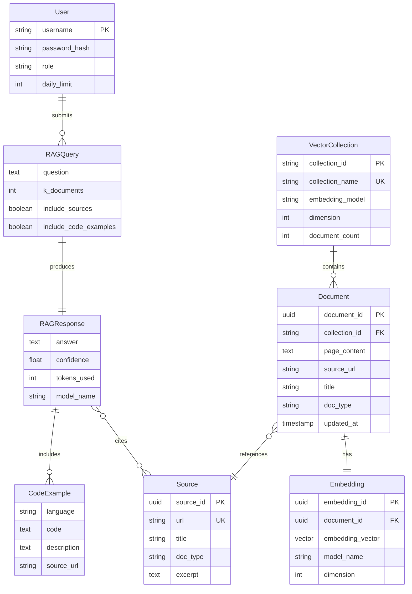
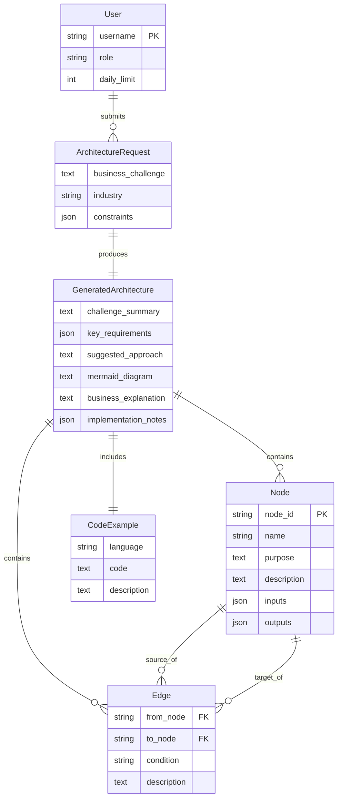
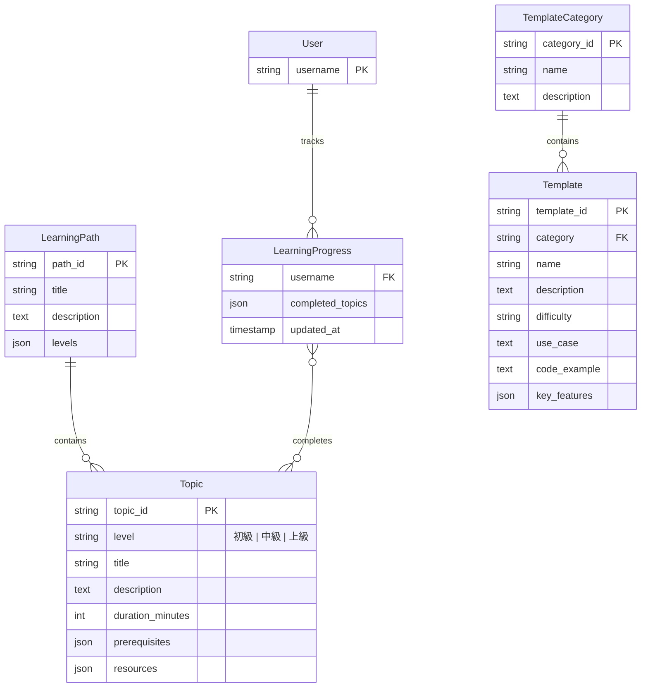
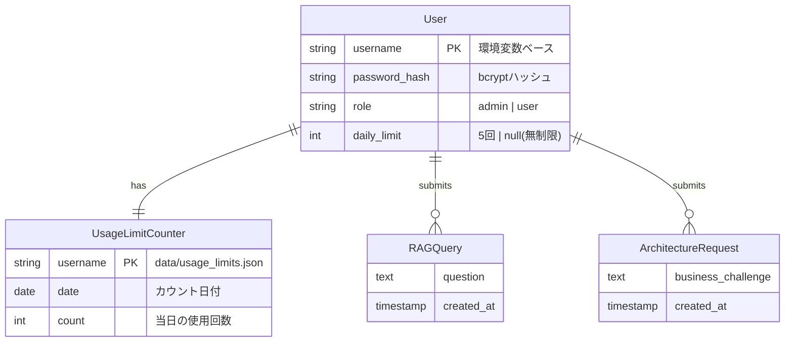

# LangGraph Catalyst - ER図

## 目次
- [概要](#概要)
- [エンティティ一覧](#エンティティ一覧)
- [ER図（全体）](#er図全体)
- [ER図（RAG機能）](#er図rag機能)
- [ER図（構成案生成機能）](#er図構成案生成機能)
- [ER図（学習パス・テンプレート機能）](#er図学習パステンプレート機能)
- [ER図（認証・使用制限）](#er図認証使用制限)
- [エンティティ詳細](#エンティティ詳細)
- [リレーションシップ詳細](#リレーションシップ詳細)
- [インデックス設計](#インデックス設計)

---

## 概要

### 目的
LangGraph Catalystシステムのデータモデルを視覚化し、エンティティ間の関係を明確にします。

### データストア

| データストア | 用途 | 永続性 | 実装状況 |
|------------|------|--------|---------|
| **Chroma** | ベクトルDB（ドキュメント、埋め込み） | ローカルファイル | ✅ 実装済み |
| **Zustand + localStorage** | React状態管理（学習進捗） | ブラウザストレージ | ✅ 実装済み |
| **環境変数** | ユーザー認証情報（4ユーザー） | 環境変数 | ✅ 実装済み |
| **ファイルシステム** | 使用制限カウンター（JSON） | ローカルファイル | ✅ 実装済み |
| **Python定数** | 学習パス、テンプレート定義 | コード内定義 | ✅ 実装済み |

### バージョン
- ドキュメントバージョン: 2.0.0
- 最終更新日: 2026-02-07
- Phase: Phase 9（React + FastAPI）完了

---

## エンティティ一覧

| エンティティ名 | 説明 | データストア | 実装状況 |
|--------------|------|-------------|---------|
| **Document** | RAGで使用するドキュメント | Chroma | ✅ |
| **VectorCollection** | ベクトルストアのコレクション | Chroma | ✅ |
| **Embedding** | ドキュメントの埋め込みベクトル | Chroma | ✅ |
| **RAGQuery** | RAGクエリの履歴 | React State | ✅ |
| **RAGResponse** | RAG回答結果 | React State | ✅ |
| **Source** | ドキュメントのソース情報 | Chroma Metadata | ✅ |
| **CodeExample** | コード例 | React State | ✅ |
| **ArchitectureRequest** | 構成案生成リクエスト | React State | ✅ |
| **GeneratedArchitecture** | 生成された構成案 | React State | ✅ |
| **Node** | LangGraphノード定義 | React State | ✅ |
| **Edge** | LangGraphエッジ定義 | React State | ✅ |
| **LearningPath** | 学習カリキュラム全体 | Python定数 | ✅ |
| **Topic** | 学習トピック（初級/中級/上級） | Python定数 | ✅ |
| **Template** | LangGraphテンプレート | Python定数 | ✅ |
| **TemplateCategory** | テンプレートカテゴリ | Python定数 | ✅ |
| **User** | ユーザー情報（環境変数ベース） | 環境変数 | ✅ |
| **UsageLimitCounter** | 使用制限カウンター | JSONファイル | ✅ |
| **LearningProgress** | 学習進捗（完了トピック） | localStorage | ✅ |

---

## ER図（全体）



---

## ER図（RAG機能）

RAG学習支援機能に関連するエンティティのみを抽出した図です。



---

## ER図（構成案生成機能）

ビジネス課題からLangGraph構成案を生成する機能に関連するエンティティです。



---

## ER図（学習パス・テンプレート機能）

学習支援機能（学習パス、テンプレート、進捗管理）に関連するエンティティです。



---

## ER図（認証・使用制限）

ユーザー認証と使用制限機能に関連するエンティティです（環境変数 + ファイルベース）。



---

## エンティティ詳細

### 1. User（ユーザー）【環境変数ベース - 実装済み】

**説明**: システムを利用するユーザー情報。環境変数から読み込み、bcryptでハッシュ化。

**属性**:
| 属性名 | 型 | 制約 | 説明 |
|--------|-----|------|------|
| `username` | STRING | PK | ユーザー名（admin, testuser1-3） |
| `password_hash` | STRING | NOT NULL | bcryptハッシュ化されたパスワード |
| `role` | STRING | NOT NULL | "admin" \| "user" |
| `daily_limit` | INT \| NULL | | 1日の使用回数制限（Noneは無制限） |

**実装**:
- `backend/core/users.py`
- 環境変数: `ADMIN_PASSWORD`, `TESTUSER1_PASSWORD`, `TESTUSER2_PASSWORD`, `TESTUSER3_PASSWORD`

**サンプルデータ**:
```python
{
    "username": "admin",
    "password_hash": "$2b$12$...",  # bcryptハッシュ
    "role": "admin",
    "daily_limit": None  # 無制限
}

{
    "username": "testuser1",
    "password_hash": "$2b$12$...",
    "role": "user",
    "daily_limit": 5  # 1日5回まで
}
```

---

### 2. UsageLimitCounter（使用制限カウンター）【ファイルベース - 実装済み】

**説明**: ユーザーの使用回数をカウント。ファイルベース（`data/usage_limits.json`）。

**属性**:
| 属性名 | 型 | 制約 | 説明 |
|--------|-----|------|------|
| `username` | STRING | PK | ユーザー名 |
| `date` | DATE | NOT NULL | カウント日付（YYYY-MM-DD） |
| `count` | INT | NOT NULL | 当日の使用回数 |

**実装**:
- `backend/core/usage_limiter.py`
- ファイル: `data/usage_limits.json`

**注意点**:
- Render無料プランでは、再起動時にファイルがリセットされる
- 日付が変わると自動的にカウントがリセットされる

**サンプルデータ**:
```json
{
    "testuser1": {
        "date": "2026-02-07",
        "count": 3
    },
    "testuser2": {
        "date": "2026-02-07",
        "count": 1
    }
}
```

---

### 3. Document（ドキュメント）【Chroma - 実装済み】

**説明**: RAGシステムで使用するドキュメント。LangGraphの公式ドキュメント、ブログ記事、GitHubコード例などを含む。

**属性**:
| 属性名 | 型 | 制約 | 説明 |
|--------|-----|------|------|
| `document_id` | UUID | PK | ドキュメントの一意識別子 |
| `collection_id` | STRING | FK | 所属するコレクションID |
| `page_content` | TEXT | NOT NULL | ドキュメントの本文 |
| `source_url` | STRING | | ソースのURL |
| `title` | STRING | | ドキュメントのタイトル |
| `doc_type` | STRING | | "official_docs" \| "blog" \| "github" |
| `updated_at` | TIMESTAMP | | ソースの更新日時 |
| `indexed_at` | TIMESTAMP | | 索引化された日時 |
| `metadata` | JSON | | その他のメタデータ |

**サンプルデータ**:
```json
{
  "document_id": "550e8400-e29b-41d4-a716-446655440000",
  "collection_id": "langgraph_docs",
  "page_content": "LangGraph is a library for building stateful...",
  "source_url": "https://langchain-ai.github.io/langgraph/",
  "title": "Introduction to LangGraph",
  "doc_type": "official_docs",
  "updated_at": "2026-01-15T10:30:00Z",
  "indexed_at": "2026-01-16T08:00:00Z",
  "metadata": {
    "section": "Getting Started",
    "language": "en"
  }
}
```

---

### 4. LearningPath（学習パス）【Python定数 - 実装済み】

**説明**: LangGraph学習の体系的なカリキュラム。初級〜上級のトピックを含む。

**属性**:
| 属性名 | 型 | 制約 | 説明 |
|--------|-----|------|------|
| `path_id` | STRING | PK | "langgraph_learning_path" |
| `title` | STRING | NOT NULL | 学習パスのタイトル |
| `description` | TEXT | | 学習パスの説明 |
| `levels` | JSON | | レベル別トピック（初級/中級/上級） |

**実装**:
- `src/features/learning_path/learning_path.py`

**サンプルデータ**:
```python
{
    "path_id": "langgraph_learning_path",
    "title": "LangGraph 学習パス",
    "description": "初級から上級まで、LangGraphをマスターするための体系的なカリキュラム",
    "levels": {
        "初級": [
            {"topic_id": "intro-to-langgraph", ...},
            {"topic_id": "basic-graph", ...}
        ],
        "中級": [...],
        "上級": [...]
    }
}
```

---

### 5. Topic（学習トピック）【Python定数 - 実装済み】

**説明**: 学習パス内の個別トピック。

**属性**:
| 属性名 | 型 | 制約 | 説明 |
|--------|-----|------|------|
| `topic_id` | STRING | PK | トピックID（例: "intro-to-langgraph"） |
| `level` | STRING | NOT NULL | "初級" \| "中級" \| "上級" |
| `title` | STRING | NOT NULL | トピックのタイトル |
| `description` | TEXT | | トピックの説明 |
| `duration_minutes` | INT | | 推定学習時間（分） |
| `prerequisites` | JSON | | 前提トピックのIDリスト |
| `resources` | JSON | | 学習リソース（URL等） |

**サンプルデータ**:
```python
{
    "topic_id": "intro-to-langgraph",
    "level": "初級",
    "title": "LangGraphとは",
    "description": "LangGraphの基本概念と使い方を学びます",
    "duration_minutes": 30,
    "prerequisites": [],
    "resources": [
        {"type": "official_docs", "url": "https://..."},
        {"type": "video", "url": "https://..."}
    ]
}
```

---

### 6. Template（テンプレート）【Python定数 - 実装済み】

**説明**: LangGraphのユースケース別テンプレート。

**属性**:
| 属性名 | 型 | 制約 | 説明 |
|--------|-----|------|------|
| `template_id` | STRING | PK | テンプレートID |
| `category` | STRING | FK | カテゴリID |
| `name` | STRING | NOT NULL | テンプレート名 |
| `description` | TEXT | | テンプレートの説明 |
| `difficulty` | STRING | | "初級" \| "中級" \| "上級" |
| `use_case` | TEXT | | ユースケースの説明 |
| `code_example` | TEXT | | コード例 |
| `key_features` | JSON | | 主要機能のリスト |

**実装**:
- `src/features/templates/templates.py`

**サンプルデータ**:
```python
{
    "template_id": "chatbot",
    "category": "conversational",
    "name": "基本的なチャットボット",
    "description": "状態管理を使った対話型チャットボット",
    "difficulty": "初級",
    "use_case": "カスタマーサポート、FAQ自動応答",
    "code_example": "from langgraph.graph import StateGraph\n...",
    "key_features": [
        "対話履歴管理",
        "コンテキスト保持",
        "エラーハンドリング"
    ]
}
```

---

### 7. LearningProgress（学習進捗）【localStorage - 実装済み】

**説明**: ユーザーの学習進捗を管理。完了したトピックIDをlocalStorageに保存。

**属性**:
| 属性名 | 型 | 制約 | 説明 |
|--------|-----|------|------|
| `username` | STRING | FK | ユーザー名 |
| `completed_topics` | JSON | | 完了したtopic_idのリスト |
| `updated_at` | TIMESTAMP | | 最終更新日時 |

**実装**:
- `frontend/src/store/learningStore.ts`
- Zustand + persist middleware（localStorage）

**サンプルデータ**:
```json
{
    "username": "admin",
    "completed_topics": [
        "intro-to-langgraph",
        "basic-graph",
        "state-management"
    ],
    "updated_at": "2026-02-07T10:30:00Z"
}
```

---

## リレーションシップ詳細

### 1. User ↔ UsageLimitCounter (1:1)

**関係**: 1人のユーザーに1つの使用制限カウンター

**カーディナリティ**: 1対1（1:1）

**実装**: ファイルベース（data/usage_limits.json）

**制約**:
- 日付が変わると自動的にカウントがリセット
- Render無料プランでは再起動時にファイルが消える可能性あり

---

### 2. User ↔ LearningProgress (1:1)

**関係**: 1人のユーザーに1つの学習進捗

**カーディナリティ**: 1対1（1:1）

**実装**: Zustand + localStorage（フロントエンド）

**制約**:
- ブラウザごとに独立して管理
- localStorageクリア時にデータが消える

---

### 3. LearningPath ↔ Topic (1:N)

**関係**: 1つの学習パスに複数のトピック

**カーディナリティ**: 1対多（1:N）

**実装**: Python定数（`src/features/learning_path/learning_path.py`）

---

### 4. TemplateCategory ↔ Template (1:N)

**関係**: 1つのカテゴリに複数のテンプレート

**カーディナリティ**: 1対多（1:N）

**実装**: Python定数（`src/features/templates/templates.py`）

---

## インデックス設計

### 1. Document テーブル（Chroma）

Chromaでは自動的にベクトルインデックスが作成されます。

```python
# Chroma Metadata インデックス
collection.add(
    documents=[...],
    metadatas=[{"doc_type": "official_docs", ...}],
    ids=[...]
)

# メタデータでフィルタリング可能
results = collection.query(
    query_texts=["..."],
    where={"doc_type": "official_docs"}
)
```

---

### 2. UsageLimitCounter（JSON）

ファイルベースのため、Pythonの辞書でO(1)アクセス。

```python
# data/usage_limits.json
{
    "testuser1": {"date": "2026-02-07", "count": 3},
    "testuser2": {"date": "2026-02-07", "count": 1}
}

# アクセス
usage_data["testuser1"]  # O(1)
```

---

### 3. LearningProgress（localStorage）

Zustandの`persist`ミドルウェアで自動的にlocalStorageに保存。

```typescript
// localStorage key: "learning-progress"
{
    "state": {
        "completedTopics": ["intro-to-langgraph", "basic-graph"]
    }
}
```

---

## データ制約

### 1. ドメイン制約

```python
# doc_type の制約
DOC_TYPES = ["official_docs", "blog", "github"]

# level の制約
LEVELS = ["初級", "中級", "上級"]

# role の制約
ROLES = ["admin", "user"]

# difficulty の制約
DIFFICULTIES = ["初級", "中級", "上級"]
```

---

### 2. 値の範囲制約

```python
# daily_limit は正の整数または None
assert daily_limit is None or daily_limit > 0

# count は非負整数
assert count >= 0

# duration_minutes は正の整数
assert duration_minutes > 0
```

---

## データ永続化戦略

### 現在の実装（Phase 9完了）

| データ | ストア | 永続性 | 制約 |
|--------|--------|--------|------|
| **ドキュメント・埋め込み** | Chroma（ローカルファイル） | ✅ 永続 | ディスク容量依存 |
| **ユーザー情報** | 環境変数 | ✅ 永続 | 4ユーザー固定 |
| **使用制限カウンター** | JSONファイル | ⚠️ 準永続 | Render再起動でリセット |
| **学習進捗** | localStorage | ⚠️ ブラウザ依存 | ブラウザごと独立 |
| **学習パス・テンプレート** | Python定数 | ✅ 永続 | コード内定義 |
| **RAG履歴・構成案** | React State | ❌ 一時的 | ページリロードで消失 |

### 将来の拡張（オプション）

- PostgreSQL等のRDBでユーザー管理、履歴管理を実装
- Redis等でキャッシング、セッション管理
- S3等のオブジェクトストレージでChromaデータのバックアップ

---

## 付録

### A. Chroma Metadata Schema

ChromaではメタデータをJSON形式で保存します。

```python
# Chroma Document Metadata
{
    "document_id": "uuid-string",
    "source": "https://...",
    "title": "Document Title",
    "doc_type": "official_docs",
    "updated_at": "2026-01-15T00:00:00Z",
    "section": "Getting Started",
    "language": "en"
}
```

---

### B. 環境変数ベースのユーザー管理

```python
# backend/core/users.py
def initialize_users() -> dict[str, User]:
    """環境変数からユーザー情報を読み込んで初期化"""
    users = {
        "admin": User(
            username="admin",
            password_hash=get_password_hash(os.getenv("ADMIN_PASSWORD", "admin123")),
            role="admin",
            daily_limit=None  # 無制限
        ),
        "testuser1": User(
            username="testuser1",
            password_hash=get_password_hash(os.getenv("TESTUSER1_PASSWORD", "test123")),
            role="user",
            daily_limit=5  # 1日5回まで
        ),
        # ... testuser2, testuser3
    }
    return users
```

---

### C. TypeScript型定義（フロントエンド）

```typescript
// frontend/src/types/index.ts

export interface Topic {
    topic_id: string;
    level: '初級' | '中級' | '上級';
    title: string;
    description: string;
    duration_minutes: number;
    prerequisites: string[];
    resources: Array<{
        type: string;
        url: string;
        title?: string;
    }>;
}

export interface Template {
    template_id: string;
    category: string;
    name: string;
    description: string;
    difficulty: '初級' | '中級' | '上級';
    use_case: string;
    code_example: string;
    key_features: string[];
}

export interface LearningProgress {
    completedTopics: string[];
}
```

---

## 変更履歴

| バージョン | 日付 | 変更内容 |
|-----------|------|---------|
| 2.0.0 | 2026-02-07 | Phase 9完了に伴う大幅更新（環境変数ベースユーザー管理、学習パス・テンプレート追加、React状態管理） |
| 1.0.0 | 2026-01-19 | 初版作成（Streamlit版） |

---

**Last Updated**: 2026-02-07
