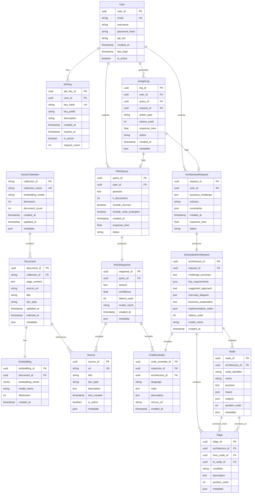
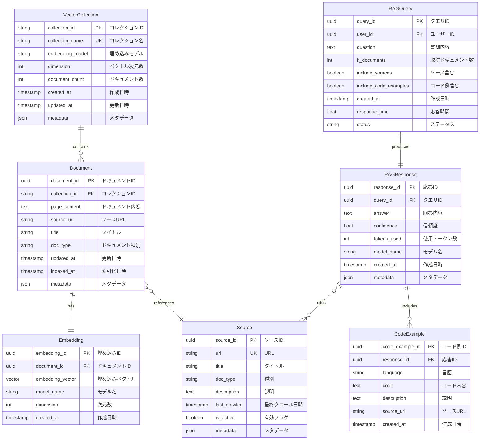
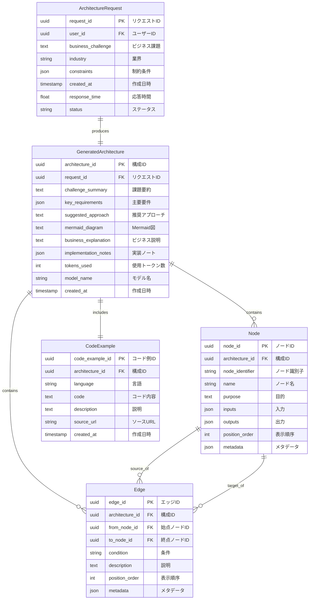
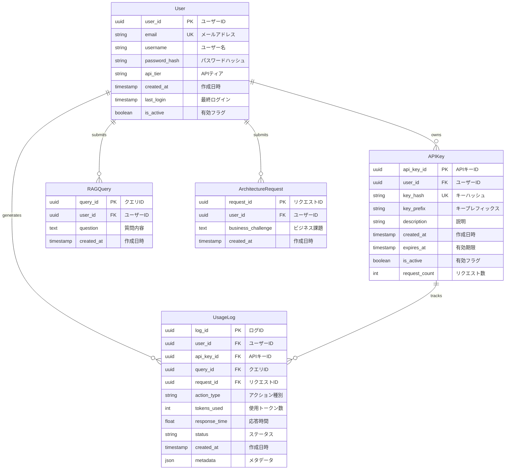

# LangGraph Catalyst - ER図

## 目次
- [概要](#概要)
- [エンティティ一覧](#エンティティ一覧)
- [ER図（全体）](#er図全体)
- [ER図（RAG機能）](#er図rag機能)
- [ER図（構成案生成機能）](#er図構成案生成機能)
- [エンティティ詳細](#エンティティ詳細)
- [リレーションシップ詳細](#リレーションシップ詳細)
- [インデックス設計](#インデックス設計)

---

## 概要

### 目的
LangGraph Catalystシステムのデータモデルを視覚化し、エンティティ間の関係を明確にします。

### データストア
- **ベクトルDB**: Chroma（ドキュメント、埋め込みベクトル）
- **セッションストア**: Streamlit Session State（一時データ）
- **ファイルシステム**: ローカルストレージ（Chroma永続化）
- **RDB（将来実装）**: PostgreSQL等（ユーザー管理、履歴管理）

### バージョン
- ドキュメントバージョン: 1.0.0
- 最終更新日: 2026-01-19

---

## エンティティ一覧

| エンティティ名 | 説明 | データストア |
|--------------|------|-------------|
| **Document** | RAGで使用するドキュメント | Chroma |
| **VectorCollection** | ベクトルストアのコレクション | Chroma |
| **Embedding** | ドキュメントの埋め込みベクトル | Chroma |
| **RAGQuery** | RAGクエリの履歴 | Session State / RDB |
| **RAGResponse** | RAG回答結果 | Session State / RDB |
| **Source** | ドキュメントのソース情報 | Chroma Metadata |
| **CodeExample** | コード例 | Session State / RDB |
| **ArchitectureRequest** | 構成案生成リクエスト | Session State / RDB |
| **GeneratedArchitecture** | 生成された構成案 | Session State / RDB |
| **Node** | LangGraphノード定義 | Session State / RDB |
| **Edge** | LangGraphエッジ定義 | Session State / RDB |
| **User** (将来) | ユーザー情報 | RDB |
| **APIKey** (将来) | API認証キー | RDB |
| **UsageLog** (将来) | 使用履歴ログ | RDB |

---

## ER図（全体）



---

## ER図（RAG機能）

RAG学習支援機能に関連するエンティティのみを抽出した図です。



---

## ER図（構成案生成機能）

ビジネス課題からLangGraph構成案を生成する機能に関連するエンティティです。



---

## ER図（ユーザー管理・将来実装）

将来的なAPI公開を見据えたユーザー管理機能のエンティティです。



---

## エンティティ詳細

### 1. Document（ドキュメント）

**説明**: RAGシステムで使用するドキュメント。LangGraphの公式ドキュメント、ブログ記事、GitHubコード例などを含む。

**属性**:
| 属性名 | 型 | 制約 | 説明 |
|--------|-----|------|------|
| `document_id` | UUID | PK | ドキュメントの一意識別子 |
| `collection_id` | STRING | FK | 所属するコレクションID |
| `page_content` | TEXT | NOT NULL | ドキュメントの本文 |
| `source_url` | STRING | | ソースのURL |
| `title` | STRING | | ドキュメントのタイトル |
| `doc_type` | STRING | | "official_docs" \| "blog" \| "github" |
| `updated_at` | TIMESTAMP | | ソースの更新日時 |
| `indexed_at` | TIMESTAMP | | 索引化された日時 |
| `metadata` | JSON | | その他のメタデータ |

**サンプルデータ**:
```json
{
  "document_id": "550e8400-e29b-41d4-a716-446655440000",
  "collection_id": "langgraph_docs",
  "page_content": "LangGraph is a library for building stateful...",
  "source_url": "https://langchain-ai.github.io/langgraph/",
  "title": "Introduction to LangGraph",
  "doc_type": "official_docs",
  "updated_at": "2026-01-15T10:30:00Z",
  "indexed_at": "2026-01-16T08:00:00Z",
  "metadata": {
    "section": "Getting Started",
    "language": "en"
  }
}
```

---

### 2. Embedding（埋め込みベクトル）

**説明**: ドキュメントの埋め込みベクトル表現。類似度検索に使用される。

**属性**:
| 属性名 | 型 | 制約 | 説明 |
|--------|-----|------|------|
| `embedding_id` | UUID | PK | 埋め込みの一意識別子 |
| `document_id` | UUID | FK, UK | 対応するドキュメントID |
| `embedding_vector` | VECTOR | NOT NULL | 埋め込みベクトル（1536次元等） |
| `model_name` | STRING | | 使用した埋め込みモデル |
| `dimension` | INT | | ベクトルの次元数 |
| `created_at` | TIMESTAMP | | 作成日時 |

**備考**: Chromaでは自動的に管理されます。

---

### 3. RAGQuery（RAGクエリ）

**説明**: ユーザーから送信されたRAGクエリの履歴。

**属性**:
| 属性名 | 型 | 制約 | 説明 |
|--------|-----|------|------|
| `query_id` | UUID | PK | クエリの一意識別子 |
| `user_id` | UUID | FK, NULL | ユーザーID（将来実装） |
| `question` | TEXT | NOT NULL | ユーザーの質問 |
| `k_documents` | INT | DEFAULT 5 | 取得するドキュメント数 |
| `include_sources` | BOOLEAN | DEFAULT TRUE | ソースを含めるか |
| `include_code_examples` | BOOLEAN | DEFAULT TRUE | コード例を含めるか |
| `created_at` | TIMESTAMP | NOT NULL | クエリ作成日時 |
| `response_time` | FLOAT | | 応答時間（秒） |
| `status` | STRING | | "success" \| "error" \| "timeout" |

**サンプルデータ**:
```json
{
  "query_id": "660e8400-e29b-41d4-a716-446655440001",
  "user_id": null,
  "question": "How do I create a conditional edge in LangGraph?",
  "k_documents": 5,
  "include_sources": true,
  "include_code_examples": true,
  "created_at": "2026-01-19T14:23:45Z",
  "response_time": 3.45,
  "status": "success"
}
```

---

### 4. RAGResponse（RAG応答）

**説明**: RAGクエリに対する応答結果。

**属性**:
| 属性名 | 型 | 制約 | 説明 |
|--------|-----|------|------|
| `response_id` | UUID | PK | 応答の一意識別子 |
| `query_id` | UUID | FK, UK | 対応するクエリID |
| `answer` | TEXT | NOT NULL | 生成された回答 |
| `confidence` | FLOAT | | 信頼度スコア（0-1） |
| `tokens_used` | INT | | 使用したトークン数 |
| `model_name` | STRING | | 使用したLLMモデル |
| `created_at` | TIMESTAMP | NOT NULL | 応答作成日時 |
| `metadata` | JSON | | その他のメタデータ |

---

### 5. Source（ソース情報）

**説明**: ドキュメントのソース情報。回答に引用される情報源。

**属性**:
| 属性名 | 型 | 制約 | 説明 |
|--------|-----|------|------|
| `source_id` | UUID | PK | ソースの一意識別子 |
| `url` | STRING | UK | ソースのURL |
| `title` | STRING | | タイトル |
| `doc_type` | STRING | | "official_docs" \| "blog" \| "github" |
| `description` | TEXT | | ソースの説明 |
| `last_crawled` | TIMESTAMP | | 最終クロール日時 |
| `is_active` | BOOLEAN | DEFAULT TRUE | クロール対象かどうか |
| `metadata` | JSON | | その他のメタデータ |

**サンプルデータ**:
```json
{
  "source_id": "770e8400-e29b-41d4-a716-446655440002",
  "url": "https://langchain-ai.github.io/langgraph/concepts/conditional_edges/",
  "title": "Conditional Edges - LangGraph Documentation",
  "doc_type": "official_docs",
  "description": "Guide to implementing conditional edges in LangGraph",
  "last_crawled": "2026-01-19T08:00:00Z",
  "is_active": true,
  "metadata": {
    "category": "concepts",
    "difficulty": "intermediate"
  }
}
```

---

### 6. CodeExample（コード例）

**説明**: RAG応答や構成案に含まれるコード例。

**属性**:
| 属性名 | 型 | 制約 | 説明 |
|--------|-----|------|------|
| `code_example_id` | UUID | PK | コード例の一意識別子 |
| `response_id` | UUID | FK, NULL | 対応するRAG応答ID |
| `architecture_id` | UUID | FK, NULL | 対応する構成案ID |
| `language` | STRING | NOT NULL | プログラミング言語 |
| `code` | TEXT | NOT NULL | コード内容 |
| `description` | TEXT | | コードの説明 |
| `source_url` | STRING | | ソースURL |
| `created_at` | TIMESTAMP | NOT NULL | 作成日時 |

**サンプルデータ**:
```json
{
  "code_example_id": "880e8400-e29b-41d4-a716-446655440003",
  "response_id": "660e8400-e29b-41d4-a716-446655440001",
  "architecture_id": null,
  "language": "python",
  "code": "from langgraph.graph import StateGraph\n\ndef route_message(state):\n    if state['needs_human']:\n        return 'human'\n    return 'agent'\n\ngraph.add_conditional_edges(\n    'analyze',\n    route_message,\n    {'human': 'escalate', 'agent': 'respond'}\n)",
  "description": "Example of creating conditional edges based on state",
  "source_url": "https://github.com/langchain-ai/langgraph/blob/main/examples/conditional.py",
  "created_at": "2026-01-19T14:23:48Z"
}
```

---

### 7. ArchitectureRequest（構成案リクエスト）

**説明**: ビジネス課題からLangGraph構成案を生成するリクエスト。

**属性**:
| 属性名 | 型 | 制約 | 説明 |
|--------|-----|------|------|
| `request_id` | UUID | PK | リクエストの一意識別子 |
| `user_id` | UUID | FK, NULL | ユーザーID（将来実装） |
| `business_challenge` | TEXT | NOT NULL | ビジネス課題の説明 |
| `industry` | STRING | | 業界（例: "EC", "製造業"） |
| `constraints` | JSON | | 制約条件のリスト |
| `created_at` | TIMESTAMP | NOT NULL | リクエスト作成日時 |
| `response_time` | FLOAT | | 応答時間（秒） |
| `status` | STRING | | "success" \| "error" \| "timeout" |

**サンプルデータ**:
```json
{
  "request_id": "990e8400-e29b-41d4-a716-446655440004",
  "user_id": null,
  "business_challenge": "カスタマーサポートの自動化を実現したい。FAQへの自動回答と、複雑な問い合わせは人間にエスカレーションする仕組みが必要。",
  "industry": "EC",
  "constraints": [
    "日本語対応必須",
    "既存のZendeskと連携"
  ],
  "created_at": "2026-01-19T15:10:22Z",
  "response_time": 12.67,
  "status": "success"
}
```

---

### 8. GeneratedArchitecture（生成された構成案）

**説明**: 生成されたLangGraph構成案の詳細。

**属性**:
| 属性名 | 型 | 制約 | 説明 |
|--------|-----|------|------|
| `architecture_id` | UUID | PK | 構成案の一意識別子 |
| `request_id` | UUID | FK, UK | 対応するリクエストID |
| `challenge_summary` | TEXT | | 課題の要約 |
| `key_requirements` | JSON | | 主要要件のリスト |
| `suggested_approach` | TEXT | | 推奨されるアプローチ |
| `mermaid_diagram` | TEXT | | Mermaid記法の図 |
| `business_explanation` | TEXT | | 非技術者向け説明 |
| `implementation_notes` | JSON | | 実装時の注意点 |
| `tokens_used` | INT | | 使用したトークン数 |
| `model_name` | STRING | | 使用したLLMモデル |
| `created_at` | TIMESTAMP | NOT NULL | 作成日時 |

---

### 9. Node（ノード）

**説明**: LangGraphワークフローのノード定義。

**属性**:
| 属性名 | 型 | 制約 | 説明 |
|--------|-----|------|------|
| `node_id` | UUID | PK | ノードの一意識別子 |
| `architecture_id` | UUID | FK | 所属する構成案ID |
| `node_identifier` | STRING | NOT NULL | ノード識別子（例: "A", "B"） |
| `name` | STRING | NOT NULL | ノード名（例: "問い合わせ受付"） |
| `purpose` | TEXT | | ノードの目的 |
| `inputs` | JSON | | 入力のリスト |
| `outputs` | JSON | | 出力のリスト |
| `position_order` | INT | | 表示順序 |
| `metadata` | JSON | | その他のメタデータ |

**サンプルデータ**:
```json
{
  "node_id": "aa0e8400-e29b-41d4-a716-446655440005",
  "architecture_id": "990e8400-e29b-41d4-a716-446655440004",
  "node_identifier": "A",
  "name": "問い合わせ受付",
  "purpose": "ユーザーからの問い合わせを受け付ける",
  "inputs": ["user_query", "user_id"],
  "outputs": ["query_text", "user_metadata"],
  "position_order": 1,
  "metadata": {
    "estimated_time": "< 1s",
    "complexity": "low"
  }
}
```

---

### 10. Edge（エッジ）

**説明**: LangGraphワークフローのノード間接続。

**属性**:
| 属性名 | 型 | 制約 | 説明 |
|--------|-----|------|------|
| `edge_id` | UUID | PK | エッジの一意識別子 |
| `architecture_id` | UUID | FK | 所属する構成案ID |
| `from_node_id` | UUID | FK | 始点ノードID |
| `to_node_id` | UUID | FK | 終点ノードID |
| `condition` | STRING | NULL | 条件分岐の条件（例: "Yes", "No"） |
| `description` | TEXT | | エッジの説明 |
| `position_order` | INT | | 表示順序 |
| `metadata` | JSON | | その他のメタデータ |

**サンプルデータ**:
```json
{
  "edge_id": "bb0e8400-e29b-41d4-a716-446655440006",
  "architecture_id": "990e8400-e29b-41d4-a716-446655440004",
  "from_node_id": "aa0e8400-e29b-41d4-a716-446655440005",
  "to_node_id": "cc0e8400-e29b-41d4-a716-446655440007",
  "condition": "FAQ一致",
  "description": "FAQデータベースに一致する回答が見つかった場合",
  "position_order": 1,
  "metadata": {
    "edge_type": "conditional"
  }
}
```

---

### 11. User（ユーザー）【将来実装】

**説明**: システムを利用するユーザーの情報。

**属性**:
| 属性名 | 型 | 制約 | 説明 |
|--------|-----|------|------|
| `user_id` | UUID | PK | ユーザーの一意識別子 |
| `email` | STRING | UK, NOT NULL | メールアドレス |
| `username` | STRING | | ユーザー名 |
| `password_hash` | STRING | NOT NULL | パスワードハッシュ |
| `api_tier` | STRING | DEFAULT "free" | "free" \| "basic" \| "pro" |
| `created_at` | TIMESTAMP | NOT NULL | アカウント作成日時 |
| `last_login` | TIMESTAMP | | 最終ログイン日時 |
| `is_active` | BOOLEAN | DEFAULT TRUE | アカウント有効フラグ |

---

### 12. APIKey（APIキー）【将来実装】

**説明**: API認証用のキー情報。

**属性**:
| 属性名 | 型 | 制約 | 説明 |
|--------|-----|------|------|
| `api_key_id` | UUID | PK | APIキーの一意識別子 |
| `user_id` | UUID | FK | 所有者のユーザーID |
| `key_hash` | STRING | UK, NOT NULL | APIキーのハッシュ |
| `key_prefix` | STRING | | キーのプレフィックス（表示用） |
| `description` | STRING | | キーの説明 |
| `created_at` | TIMESTAMP | NOT NULL | 作成日時 |
| `expires_at` | TIMESTAMP | | 有効期限 |
| `is_active` | BOOLEAN | DEFAULT TRUE | 有効フラグ |
| `request_count` | INT | DEFAULT 0 | リクエスト数カウント |

---

### 13. UsageLog（使用履歴ログ）【将来実装】

**説明**: APIやシステムの使用履歴を記録。

**属性**:
| 属性名 | 型 | 制約 | 説明 |
|--------|-----|------|------|
| `log_id` | UUID | PK | ログの一意識別子 |
| `user_id` | UUID | FK | ユーザーID |
| `api_key_id` | UUID | FK, NULL | 使用したAPIキーID |
| `query_id` | UUID | FK, NULL | RAGクエリID |
| `request_id` | UUID | FK, NULL | 構成案リクエストID |
| `action_type` | STRING | NOT NULL | "rag_query" \| "arch_generate" |
| `tokens_used` | INT | | 使用トークン数 |
| `response_time` | FLOAT | | 応答時間（秒） |
| `status` | STRING | | "success" \| "error" |
| `created_at` | TIMESTAMP | NOT NULL | ログ記録日時 |
| `metadata` | JSON | | その他のメタデータ |

---

## リレーションシップ詳細

### 1. VectorCollection ↔ Document (1:N)

**関係**: 1つのコレクションに複数のドキュメントが含まれる

**カーディナリティ**: 1対多（1:N）

**外部キー**: `Document.collection_id` → `VectorCollection.collection_id`

**制約**:
- ドキュメント削除時: コレクションは維持（DELETE NO ACTION）
- コレクション削除時: 全ドキュメントも削除（DELETE CASCADE）

---

### 2. Document ↔ Embedding (1:1)

**関係**: 1つのドキュメントに1つの埋め込みベクトル

**カーディナリティ**: 1対1（1:1）

**外部キー**: `Embedding.document_id` → `Document.document_id`

**制約**:
- ドキュメント削除時: 埋め込みも削除（DELETE CASCADE）
- `Embedding.document_id` は UNIQUE

---

### 3. RAGQuery ↔ RAGResponse (1:1)

**関係**: 1つのクエリに1つの応答

**カーディナリティ**: 1対1（1:1）

**外部キー**: `RAGResponse.query_id` → `RAGQuery.query_id`

**制約**:
- クエリ削除時: 応答も削除（DELETE CASCADE）
- `RAGResponse.query_id` は UNIQUE

---

### 4. RAGResponse ↔ CodeExample (1:N)

**関係**: 1つの応答に複数のコード例

**カーディナリティ**: 1対多（1:N）

**外部キー**: `CodeExample.response_id` → `RAGResponse.response_id`

**制約**:
- 応答削除時: コード例も削除（DELETE CASCADE）

---

### 5. ArchitectureRequest ↔ GeneratedArchitecture (1:1)

**関係**: 1つのリクエストに1つの構成案

**カーディナリティ**: 1対1（1:1）

**外部キー**: `GeneratedArchitecture.request_id` → `ArchitectureRequest.request_id`

**制約**:
- リクエスト削除時: 構成案も削除（DELETE CASCADE）
- `GeneratedArchitecture.request_id` は UNIQUE

---

### 6. GeneratedArchitecture ↔ Node (1:N)

**関係**: 1つの構成案に複数のノード

**カーディナリティ**: 1対多（1:N）

**外部キー**: `Node.architecture_id` → `GeneratedArchitecture.architecture_id`

**制約**:
- 構成案削除時: 全ノードも削除（DELETE CASCADE）

---

### 7. GeneratedArchitecture ↔ Edge (1:N)

**関係**: 1つの構成案に複数のエッジ

**カーディナリティ**: 1対多（1:N）

**外部キー**: `Edge.architecture_id` → `GeneratedArchitecture.architecture_id`

**制約**:
- 構成案削除時: 全エッジも削除（DELETE CASCADE）

---

### 8. Node ↔ Edge (N:M through Edge table)

**関係**: ノード間の多対多接続（Edgeテーブルで実現）

**カーディナリティ**: 多対多（N:M）

**外部キー**:
- `Edge.from_node_id` → `Node.node_id`
- `Edge.to_node_id` → `Node.node_id`

**制約**:
- ノード削除時: 関連するエッジも削除（DELETE CASCADE）

---

### 9. User ↔ APIKey (1:N) 【将来実装】

**関係**: 1人のユーザーが複数のAPIキーを所有

**カーディナリティ**: 1対多（1:N）

**外部キー**: `APIKey.user_id` → `User.user_id`

**制約**:
- ユーザー削除時: 全APIキーも削除（DELETE CASCADE）

---

### 10. User ↔ UsageLog (1:N) 【将来実装】

**関係**: 1人のユーザーが複数の使用履歴を持つ

**カーディナリティ**: 1対多（1:N）

**外部キー**: `UsageLog.user_id` → `User.user_id`

**制約**:
- ユーザー削除時: 使用履歴は保持（DELETE SET NULL）

---

## インデックス設計

### 1. Document テーブル

```sql
-- プライマリキー
CREATE INDEX idx_document_id ON Document(document_id);

-- 外部キー
CREATE INDEX idx_document_collection_id ON Document(collection_id);

-- 検索用
CREATE INDEX idx_document_doc_type ON Document(doc_type);
CREATE INDEX idx_document_updated_at ON Document(updated_at DESC);

-- 全文検索（オプション）
CREATE FULLTEXT INDEX idx_document_content ON Document(page_content);
```

---

### 2. RAGQuery テーブル

```sql
-- プライマリキー
CREATE INDEX idx_query_id ON RAGQuery(query_id);

-- 外部キー
CREATE INDEX idx_query_user_id ON RAGQuery(user_id);

-- 検索用
CREATE INDEX idx_query_created_at ON RAGQuery(created_at DESC);
CREATE INDEX idx_query_status ON RAGQuery(status);

-- 複合インデックス
CREATE INDEX idx_query_user_created ON RAGQuery(user_id, created_at DESC);
```

---

### 3. GeneratedArchitecture テーブル

```sql
-- プライマリキー
CREATE INDEX idx_architecture_id ON GeneratedArchitecture(architecture_id);

-- 外部キー
CREATE INDEX idx_architecture_request_id ON GeneratedArchitecture(request_id);

-- 検索用
CREATE INDEX idx_architecture_created_at ON GeneratedArchitecture(created_at DESC);
```

---

### 4. UsageLog テーブル 【将来実装】

```sql
-- プライマリキー
CREATE INDEX idx_log_id ON UsageLog(log_id);

-- 外部キー
CREATE INDEX idx_log_user_id ON UsageLog(user_id);
CREATE INDEX idx_log_api_key_id ON UsageLog(api_key_id);

-- 検索用
CREATE INDEX idx_log_created_at ON UsageLog(created_at DESC);
CREATE INDEX idx_log_action_type ON UsageLog(action_type);

-- 複合インデックス（分析用）
CREATE INDEX idx_log_user_action_created ON UsageLog(user_id, action_type, created_at DESC);
```

---

## データ制約

### 1. ドメイン制約

```sql
-- doc_type の制約
ALTER TABLE Document ADD CONSTRAINT chk_doc_type
  CHECK (doc_type IN ('official_docs', 'blog', 'github'));

-- status の制約
ALTER TABLE RAGQuery ADD CONSTRAINT chk_query_status
  CHECK (status IN ('success', 'error', 'timeout'));

-- api_tier の制約
ALTER TABLE User ADD CONSTRAINT chk_api_tier
  CHECK (api_tier IN ('free', 'basic', 'pro'));

-- action_type の制約
ALTER TABLE UsageLog ADD CONSTRAINT chk_action_type
  CHECK (action_type IN ('rag_query', 'arch_generate'));
```

---

### 2. 値の範囲制約

```sql
-- confidence は 0-1 の範囲
ALTER TABLE RAGResponse ADD CONSTRAINT chk_confidence
  CHECK (confidence >= 0 AND confidence <= 1);

-- k_documents は正の整数
ALTER TABLE RAGQuery ADD CONSTRAINT chk_k_documents
  CHECK (k_documents > 0 AND k_documents <= 100);

-- response_time は非負
ALTER TABLE RAGQuery ADD CONSTRAINT chk_response_time
  CHECK (response_time >= 0);
```

---

## データ移行戦略

### Phase 1: 現在（Streamlit + Chroma）
- **VectorCollection**: Chromaで管理
- **Document**: Chromaで管理
- **Embedding**: Chromaで管理
- **RAGQuery, RAGResponse**: Streamlit Session State（一時的）
- **その他**: Session State（一時的）

### Phase 2: 履歴管理の追加
- **RAGQuery, RAGResponse**: SQLiteまたはPostgreSQLに移行
- **ArchitectureRequest, GeneratedArchitecture**: RDBに保存
- **Node, Edge, CodeExample**: RDBに保存

### Phase 3: ユーザー管理の追加
- **User, APIKey**: PostgreSQLに保存
- **UsageLog**: PostgreSQLに保存
- 認証・認可機能の実装

---

## 付録

### A. Chroma Metadata Schema

ChromaではメタデータをJSON形式で保存します。

```python
# Chroma Document Metadata
{
    "document_id": "uuid-string",
    "source": "https://...",
    "title": "Document Title",
    "doc_type": "official_docs",
    "updated_at": "2026-01-15T00:00:00Z",
    "section": "Getting Started",
    "language": "en"
}
```

---

### B. SQLAlchemy モデル定義例（将来実装）

```python
# models/rag.py
from sqlalchemy import Column, String, Text, Integer, Float, Boolean, DateTime, JSON, ForeignKey
from sqlalchemy.dialects.postgresql import UUID
from sqlalchemy.orm import relationship
from datetime import datetime
import uuid

class RAGQuery(Base):
    __tablename__ = "rag_queries"

    query_id = Column(UUID(as_uuid=True), primary_key=True, default=uuid.uuid4)
    user_id = Column(UUID(as_uuid=True), ForeignKey("users.user_id"), nullable=True)
    question = Column(Text, nullable=False)
    k_documents = Column(Integer, default=5)
    include_sources = Column(Boolean, default=True)
    include_code_examples = Column(Boolean, default=True)
    created_at = Column(DateTime, default=datetime.utcnow, nullable=False)
    response_time = Column(Float)
    status = Column(String(20))

    # Relationships
    user = relationship("User", back_populates="queries")
    response = relationship("RAGResponse", back_populates="query", uselist=False)
    usage_logs = relationship("UsageLog", back_populates="query")
```

---

### C. GraphQL Schema例（将来実装）

```graphql
type Document {
  documentId: ID!
  collectionId: String!
  pageContent: String!
  sourceUrl: String
  title: String
  docType: DocumentType!
  updatedAt: DateTime
  indexedAt: DateTime
  metadata: JSON
}

enum DocumentType {
  OFFICIAL_DOCS
  BLOG
  GITHUB
}

type RAGQuery {
  queryId: ID!
  userId: ID
  question: String!
  kDocuments: Int!
  includeSources: Boolean!
  includeCodeExamples: Boolean!
  createdAt: DateTime!
  responseTime: Float
  status: QueryStatus!
  response: RAGResponse
}

enum QueryStatus {
  SUCCESS
  ERROR
  TIMEOUT
}

type RAGResponse {
  responseId: ID!
  queryId: ID!
  answer: String!
  confidence: Float
  tokensUsed: Int
  modelName: String
  createdAt: DateTime!
  sources: [Source!]!
  codeExamples: [CodeExample!]!
}

type Query {
  document(documentId: ID!): Document
  ragQuery(queryId: ID!): RAGQuery
  userQueries(userId: ID!, limit: Int): [RAGQuery!]!
}

type Mutation {
  submitRAGQuery(question: String!, kDocuments: Int): RAGQuery!
  generateArchitecture(businessChallenge: String!, industry: String, constraints: [String!]): GeneratedArchitecture!
}
```

---

## 変更履歴

| バージョン | 日付 | 変更内容 |
|-----------|------|---------|
| 1.0.0 | 2026-01-19 | 初版作成 |

---

**Last Updated**: 2026-01-19
